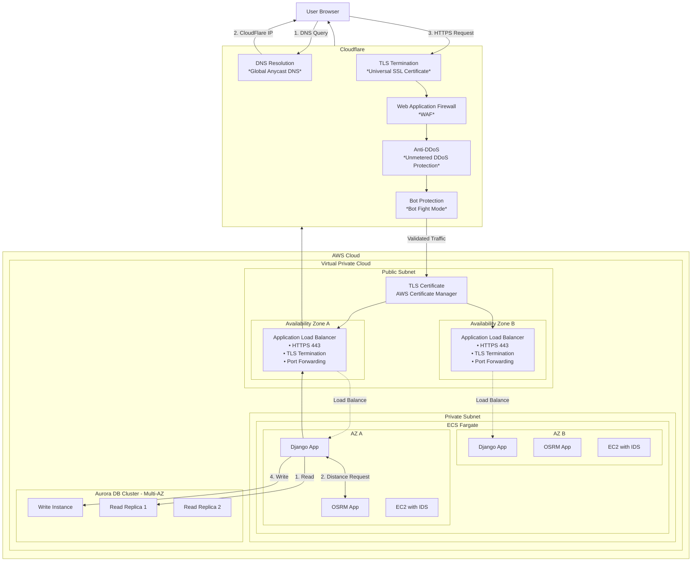

```mermaid
graph TB
    User["User Browser"]
    
    subgraph CF ["Cloudflare"]
        DNS["DNS Resolution<br/>*Global Anycast DNS*"]
        TLS["TLS Termination<br/>*Universal SSL Certificate*"]
        WAF["Web Application Firewall</br>*WAF*"]
        AntiDDoS["Anti-DDoS</br>*Unmetered DDoS Protection*"]
        Bot["Bot Protection</br>*Bot Fight Mode*"]
        
        TLS --> WAF --> AntiDDoS --> Bot
    end

    subgraph AWS ["AWS Cloud"]
        subgraph VPC ["Virtual Private Cloud"]
            direction TB
            subgraph Public ["Public Subnet"]
                TLS2["TLS Certificate<br/>AWS Certificate Manager"]
                
                subgraph PubAZ1["Availability Zone A"]
                    ALB1["Application Load Balancer<br/>• HTTPS 443<br/>• TLS Termination<br/>• Port Forwarding"]
                end
                subgraph PubAZ2["Availability Zone B"]
                    ALB2["Application Load Balancer<br/>• HTTPS 443<br/>• TLS Termination<br/>• Port Forwarding"]
                end
                TLS2 --> ALB1
                TLS2 --> ALB2
            end
            
            subgraph Private ["Private Subnet"]
                subgraph Fargate ["ECS Fargate"]
                    subgraph AZ2["AZ B"]
                        Task21["Django App"]
                        Task22["OSRM App"]
                        EC22["EC2 with IDS"]
                    end
                    subgraph AZ1["AZ A"]
                        Task11["Django App"]
                        Task12["OSRM App"]
                        EC21["EC2 with IDS"]   
                    end

                end
            end
            
            subgraph AuroraDB["Aurora DB Cluster - Multi-AZ"]
                DBW["Write Instance"]
                DBR1["Read Replica 1"]
                DBR2["Read Replica 2"]
            end
        end
    end

    %% User to Cloudflare
    User -->|"1. DNS Query"| DNS
    DNS -->|"2. CloudFlare IP"| User
    User -->|"3. HTTPS Request"| TLS

    %% Cloudflare to AWS
    Bot -->|"Validated Traffic"| TLS2

    %% Load Balancing
    ALB1 -.->|"Load Balance"| Task11
    ALB2 -.->|"Load Balance"| Task21

    %% App Communication
    Task11 <-->|"2. Distance Request"| Task12

    %% Database Access
    Task11 -->|"1. Read"| DBR1
    Task11 -->|"4. Write"| DBW

    %% Response
    Task11 --> ALB1 --> CF --> User
```