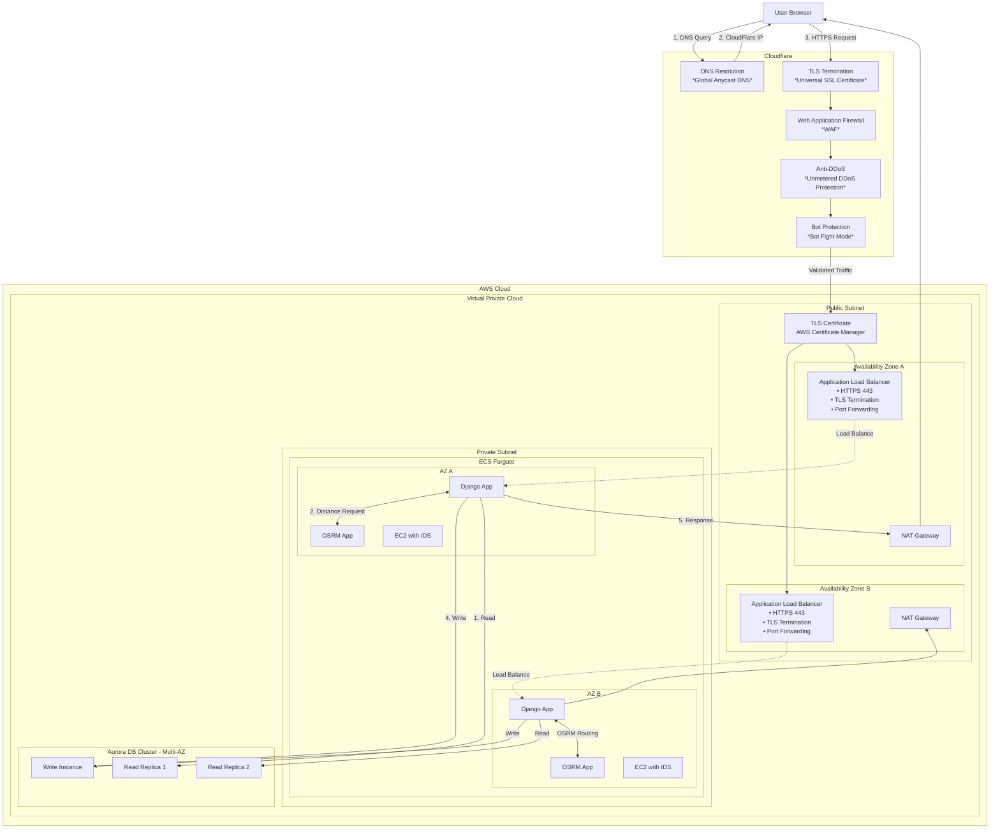
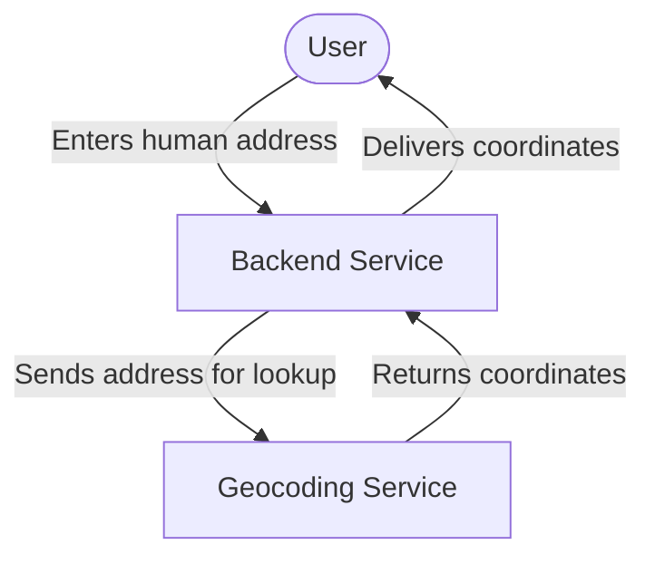

# trash-tracker
## Description
The app is a smart tool which helps trash company to find the most optimized path to collect trash from multiple points. The app is designed to be used by the trash company's drivers. The app will provide the driver with the most optimized path to collect trash from multiple points. The app will also provide the driver with the distance between each point and the total distance of the route.

## Infrastructure architecture


## Workflow



## How to set up database
1. Install Docker
2. Install Docker Compose
3. Run ```docker-compose up -d``` in the persistence directory

## How to set up the OSRM
1. Install Docker
2. Install Docker Compose
2. Download the map data from [Geofabrik](https://download.geofabrik.de/europe/poland/dolnoslaskie.html)
3. Move it to the osrm directory
4. Run ```docker run -t -v "${PWD}:/data" osrm/osrm-backend osrm-extract -p /opt/car.lua /data/dolnoslaskie-latest.osm.pbf```
5. Run ```docker run -t -v "${PWD}:/data" osrm/osrm-backend osrm-partition /data/dolnoslaskie-latest.osrm```
6. Run ```docker run -t -v "${PWD}:/data" osrm/osrm-backend osrm-customize /data/dolnoslaskie-latest.osrm```
7. Run ```docker run -t -i -p 5000:5000 -v "${PWD}:/data" osrm/osrm-backend osrm-routed --algorithm mld /data/dolnoslaskie-latest.osrm```

## How to run the app
1. Clone the repository
2. Run ```pip install -r .\src\requirements\requirements.txt```
3. Navigate to the persistence directory: ```cd persistence``` and run ```docker-compose up -d```
4. Navigate to the src directory 
5. Run ```python manage.py makemigrations routes```
6. Run ```python manage.py migrate```
7. Run ```python manage.py runserver``` to start the server