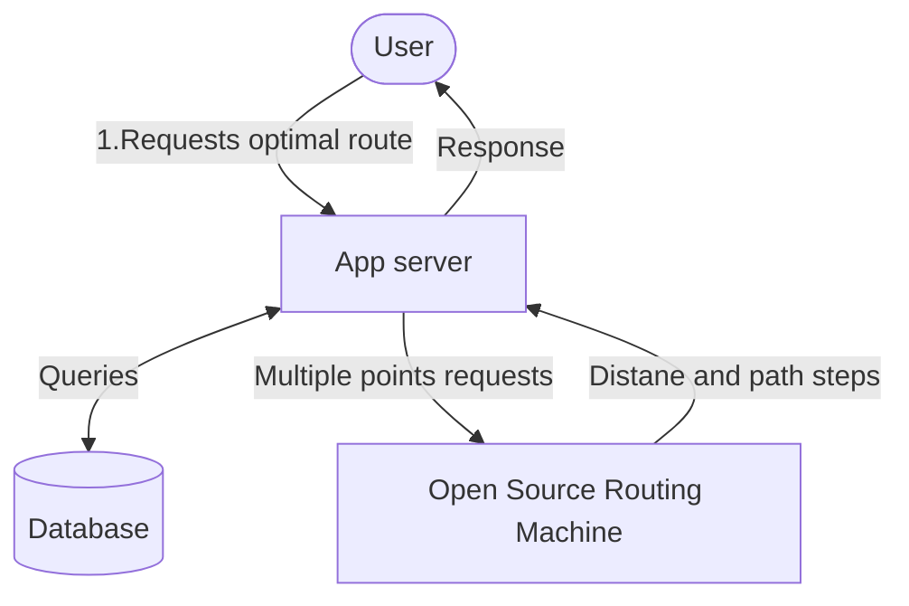

# trash-tracker
## Description
The app is a smart tool which helps trash company to find the most optimized path to collect trash from multiple points. The app is designed to be used by the trash company's drivers. The app will provide the driver with the most optimized path to collect trash from multiple points. The app will also provide the driver with the distance between each point and the total distance of the route.
## Workflows



## How to run the app
1. Clone the repository
2. Run ```pip install -r .\src\requirements\requirements.txt```
3. Run ```python .\src\manage.py runserver``` to start the server